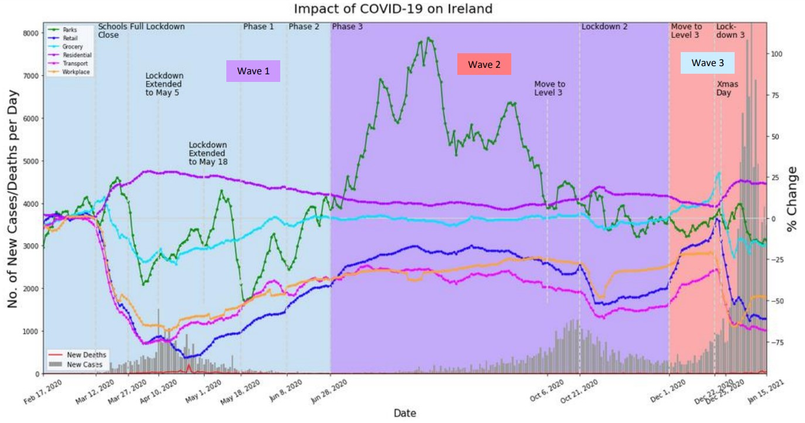

# covid2020-data-analytics
Data Analysis of the First Year of the COVID-19 Pandemic utilising both the Google and Apple datasets available

Sample Graphs were created as can been below:

This graph consists of the temporal variability of the daily Google-derived mobility categories, the daily COVID-19 cases & death rates from OWID for Ireland (n=333) in relation to government announcements, including travel restrictions and lockdowns/stay-at-home orders, national holidays and meteorological conditions from 17/02/2020 to 15/01/2021. The data used is the raw unprocessed Ireland data. The Google-derived mobility categories are Retail & Recreation, Grocery & Pharmacy Stores, Parks, Transit Stations, Workplaces and Residential, and they are represented as the % change in relation to a 5 week baseline ranging from 03/01/2020 to 06/02/2020. The 3 waves of COVID-19 in Ireland are identifiable by the colour blocks, which end at the completion of a lockdown period. Wave 1 ranges between 17/02/2020 and 28/06/2020, wave 2 ranges between 28/06/2020 and 01/12/2020 and wave 3 ranges between 01/12/2020 and 15/01/2021.

More information and graphs detailing the first 3 waves of COVID-19 in Ireland and other countries can be found here:
https://github.com/Grawnya/covid19-data-analytics-2020/blob/main/Analysing%20the%20Impact%20of%20the%20COVID-19%20Pandemic%20on%20Human%20Mobility%20.pdf
